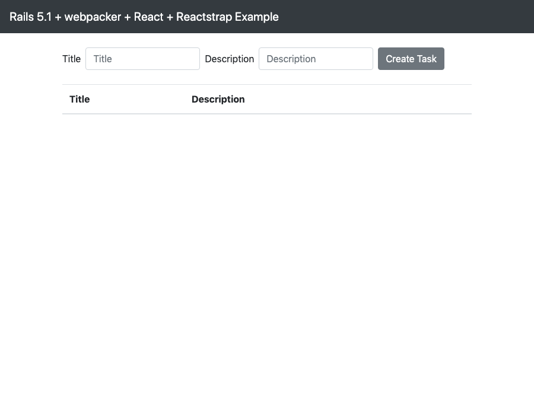

[](https://circleci.com/gh/katoy/rails_react_tutorial)

これは、 rails アプリの テストと github 連携の設定の練習レポジトリーです。  
react をつかった 小さな アプリのサンプルコードを利用しています。  
上の バッジをクリックすると、circleci でのビルド結果とテスト結果を参照できます。  
(github への push の度に build, testが実行されます。)  

DB の初期化と、アプリの起動。

```
$ bundle install
$ rails db:delete
$ rails db:create
$ rails db:migrate
$ rails db:seed_fu

$ ./bin/webpack-dev-server
$ rails s
# open http://localhost:3000
```

spec/acceptance のテストを実行すると API ドキュメントができる。
(ソースコードとドキュメントがズレることがない)
doc/apo/index.apib に blueprint 形式で生成されるようにしてある。

```
$ npm install -g aglio

$ rails docs:generate  
#  or rails rake docs:generate:ordered
($ bundle exec rspec spec/acceptance -f RspecApiDocumentation::ApiFormatter)

then
  $ aglio -i doc/api/index.apib -o doc/api/index.html
  ( $ aglio -i doc/api/index.apib -o doc/api/index.html --theme-template triple --theme-variables flatly)
  $ open doc/api/index.html
or
  $ aglio -i doc/api/index.apib -s
  then access http://localhost:3000
```

生成結果例は [doc/api/index.html](https://htmlpreview.github.io/?https://github.com/katoy/rails_react_tutorial/blob/master/doc/api/index.html)


テストの実行 (chrome headless で起動して system テストも行っている)  
system テストで失敗すると、画面のスクリーンショットが ./tmp 以下に保存される。  
いくつかのテストでは、成功した場合は、./scrennshots 以下に保存されるようにしてある。

```
$ brew install chromedriver
$ rails spec
$ (bundle exec rspec)
$ open coverage/index.html
$ open screenshots/*.png
```

スクリーンショット



その他の各種ツールの実行。

```
$ rails stats
$ rails db:migrate:status

$ bundle exec rubocop

$ bundle exec brakeman

$ yarn upgrade --latest
$ yarn audit

$ bundle exec erd
$ open erd.pdf

$ bundle exec metric_fu
  ($ bundle exec metric_fu --no-reek)
$ open tmp/metric_fu/output/index.html
```

```
$ rails log:clear
$ rails tmp:clear
```

See
- https://qiita.com/kaishuu0123/items/00b89e092f156a02a3e5
  Rails 5.1 API mode + webpacker + react + reactstrap で ToDO アプリを書く  

- https://github.com/kaishuu0123/rails5.1-react-reactstrap-example
  Rails 5.1 + webpacker + react + reactstrap Example

- https://tackeyy.com/blog/posts/token-base-api-with-rails-and-devise-token-auth
  [Rails5] devise_token_auth でAPIを作成する / 新規登録・ログイン  

- https://www.storyblok.com/tp/rspec-api-documentation
  How we use RSpec to automatically generate API documentations

- https://github.com/everydayrails/everydayrails-rspec-2017
  Everyday Rails Testing with RSpec sample application (2017 edition)

- https://techracho.bpsinc.jp/hachi8833/2018_01_25/51101
  Rails 5.1以降のシステムテストをRSpecで実行する（翻訳）

- https://qiita.com/g-fujioka/items/091c400814800f1280ff
  Capybara+headless-chrome でフルサイズのスクリーンショットを撮る

- https://softwarebrothers.co/blog/apiary-documentation-rspec-api-doc-generator/
  APIARY DOCUMENTATION WITH RSPEC API DOC GENERATOR

- https://qiita.com/kai_kou/items/630f6c1e4e577518bd14
  api blueprintとaglioを利用してAPI仕様書を作成する

- https://www.npmjs.com/package/aglio-theme-api
  Aglio Default Theme  

- https://kakakakakku.hatenablog.com/entry/2018/08/08/200903
  GitHub の README.md をバッジでオシャレにできる Shields.io と dockeri.co  
